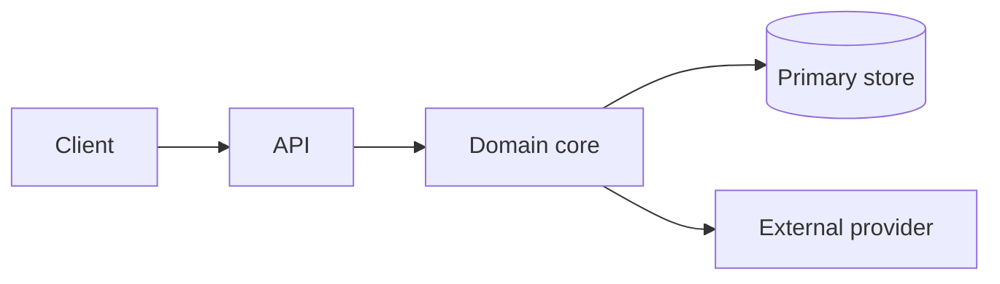

# Architecture

<!-- Canon. Read before substantial changes; updated in the same change as the behavior it
describes. State what IS, not what might be — speculation belongs in an ADR's rejected
alternatives. -->

## High-level architecture

<!-- Diagrams are text so they are reviewable in a diff. A PNG goes stale invisibly. -->

## Components

| Component | Responsible for | Explicitly NOT responsible for | Lives in |
| --- | --- | --- | --- |
| | | | |

<!-- The "not responsible for" column is the one that prevents scope creep in code review. -->

## Data flow

One representative request, end to end, naming every hop:

1.
2.
3.

<!-- Organizations that require a separate "data-flow diagram" artifact: export this section.
Never maintain a second editable copy. -->

## State

| What | Where it lives | Lifetime | Notes |
| --- | --- | --- | --- |
| | | | |

<!-- Persisted, in-memory, cached — and for cached: invalidated by what? -->

## Boundaries and invariants

<!-- The rules that must hold across components. Each one should be locatable: name the module,
file or config key that enforces it. -->

-

## Related

- Rationale for these choices: [tech-rationale.md](tech-rationale.md)
- Decision history: [adr/](adr/)
- Network, environments, residency: [infrastructure.md](infrastructure.md)
- External contracts: [communications.md](communications.md)
- Authentication and authorization: [security.md](security.md)
