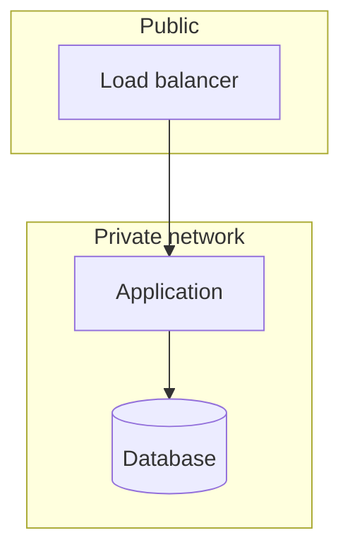

# Infrastructure

<!-- Canon. Network, environments, data residency, secrets handling. This page drifts fastest
of all the design pages, because the estate changes without touching the repository — check it
first in a drift audit. -->

## Network

**Trust boundaries:**

| Boundary | What crosses it | How it is controlled |
| --- | --- | --- |
| | | |

<!-- Organizations requiring a separate "network-flow diagram": export this section. -->

## Environments

| Environment | Purpose | Data it holds | Who can reach it | Deployed by |
| --- | --- | --- | --- | --- |
| dev | | | | merge to the integration branch |
| prod | | | | tag on the release branch |

## Data residency and classification

<!-- The table auditors actually read. Every store named in architecture.md gets a row. -->

| Store | Data type | Classification | Region | Retention | Encryption at rest |
| --- | --- | --- | --- | --- | --- |
| | | | | | |

## Secrets

| Secret | Where it lives | Who can read it | Rotation |
| --- | --- | --- | --- |
| | | | |

<!-- Names and mechanisms only. Never a value, never a fragment of one. -->

## Deployment

- **Images:** tagged `<version>+<git-sha>`. Deployments pin tags, never `latest`.
- **Rollback:** redeploy the previous tag. Made real by expand–contract migrations — every
  schema change is backward compatible for one version.
- **Promotion:** <dev → … → prod>

## Capacity and limits

| Resource | Current limit | Derived from | Observed peak |
| --- | --- | --- | --- |
| | | | |

<!-- "Derived from" should point at an NFR. A limit nobody can trace to a requirement is a
number someone guessed. -->
